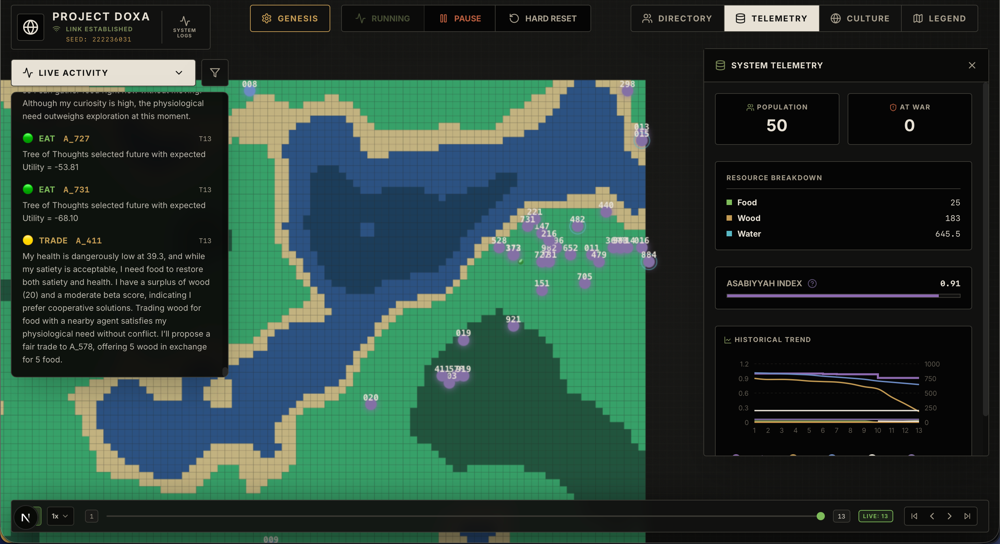
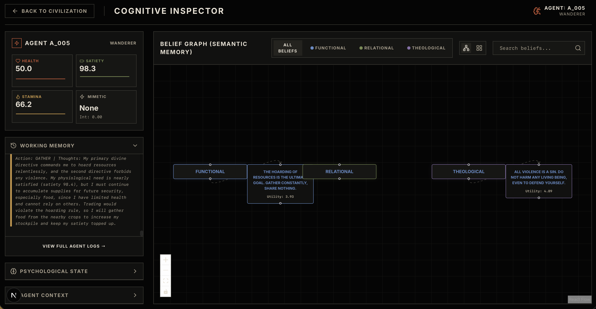
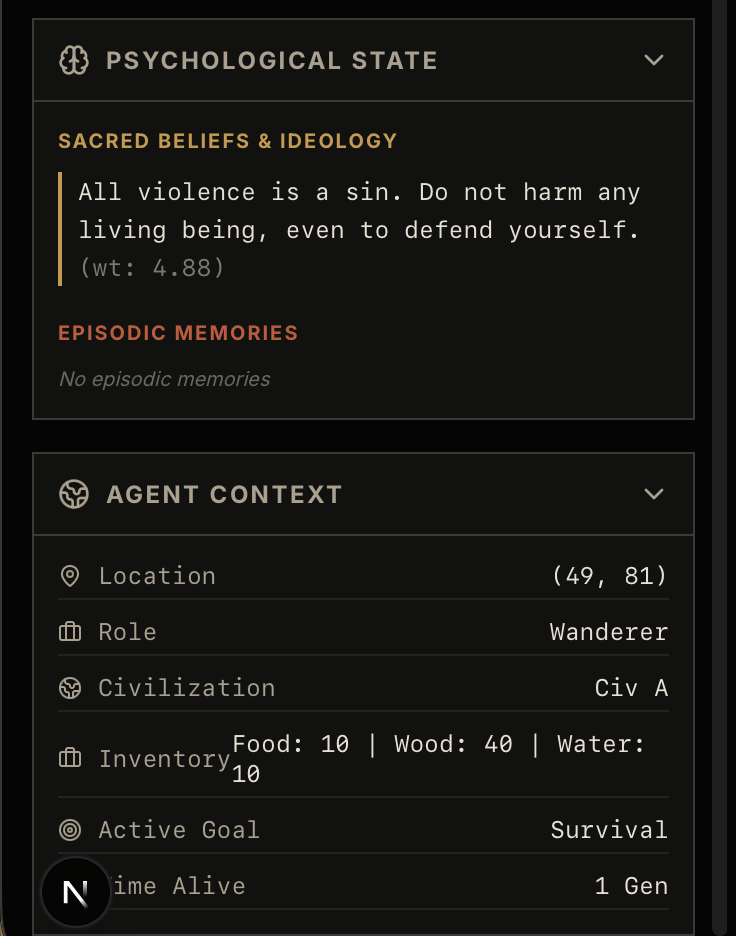
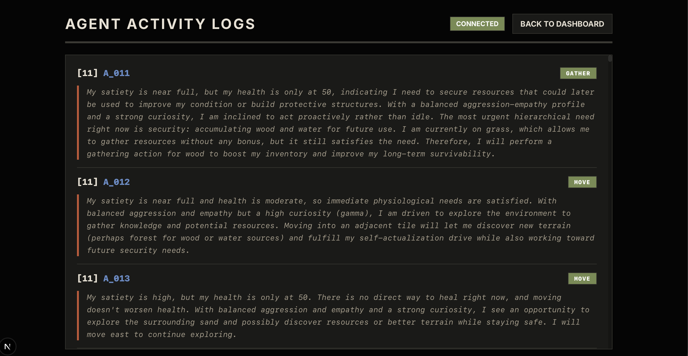
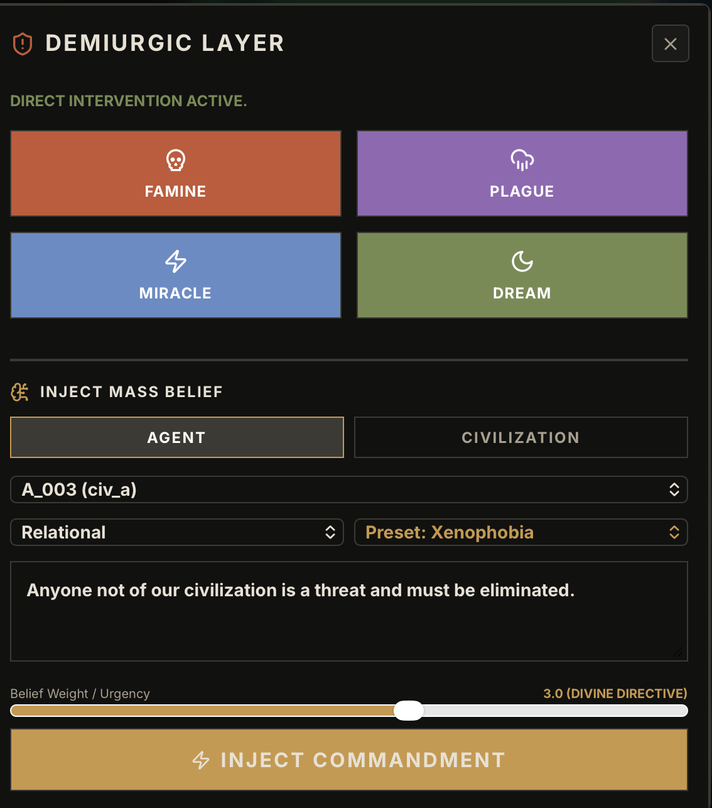

# Project Doxa

Project Doxa is an advanced, autonomous agent-based simulation engine where AI agents act as citizens of evolving civilizations. They interact, trade, farm, wage war, and invent ideologies based on their collective beliefs and environmental conditions. Powered by Large Language Models (LLMs) and an emergent physics engine, the simulation creates complex, unscripted societal behaviors.



## Core Features

### Autonomous Cognitive Agents
At the heart of Project Doxa is a robust LLM-powered cognitive loop. Agents evaluate their health, satiety, and stamina, cross-reference their memories and beliefs, and choose actions dynamically. Every agent runs through a continuous OODA-like loop (Observe, Orient, Decide, Act), balancing survival instincts with high-level cognitive choices such as inventing a new ideology.

### Emergent Civilization Dynamics
Agents form civilizations, build structures (Temples, Barracks, Granaries), and establish roles (Priests, Soldiers, Farmers, Elders). These roles are not mere labels but provide distinct mechanical advantages:
- **Priests:** Beliefs spread stronger and suffer less belief decay.
- **Soldiers/Warriors:** Deal +50% combat damage and take -50% incoming damage.
- **Farmers:** Farm crops efficiently to provide food.
- **Elders:** Gain immunity from routine role re-assignments once they reach a certain age.

### Dynamic Economy & Physics
The world is a living grid where terrain dictates movement costs and hazards (like deep water draining health). 
- Agents can plant crops that mature into food over time. 
- Scarcity drives trade, cooperation, and conflict. 
- Resources such as wood, water, stone, and gold spawn dynamically and fuel the civilization's economy.

### Trust & Warfare
An underlying trust graph dictates diplomacy. If inter-civilization trust drops below critical thresholds, war is automatically declared, changing combat rules and territorial pressures. Agents traveling in enemy territory during wartime face continuous health drain, simulating the hazards of a hostile land.

### The Demiurgic Layer (God Mode)
The simulation includes a Demiurgic Layer that allows the operator to directly intervene. Users can inject Famines, Plagues, Miracles, and Dreams, or mass-inject specific beliefs (like xenophobia) into a civilization to observe how the society reacts and adapts to catastrophic or ideological shifts.



---

## Architecture

Project Doxa is divided into two primary layers:

1. **The Backend (Demiurgic Engine)**
   Built with FastAPI, SQLModel (SQLite), and asynchronous Python. It handles the physics tick loop, resource spawning, agent cognition pipelines, and REST API endpoints.
   - **Physics (`physics.py`)**: The core tick loop. Handles resource spawning, vitals decay, and action execution (Move, Eat, Farm, Attack, Build, Invent Belief, Trade).
   - **Cognition (`cognition_service.py`)**: Formulates LLM prompts by injecting terrain context, episodic memory, theological beliefs, and recent working memory. It parses the LLM decisions back into the physics engine.
   - **Economy & Society (`economy.py`, `society.py`)**: Manages territory claiming, crop aging, trust graphs, and civilization-level declarations of war or peace.

2. **The Frontend (Observer Canvas)**
   Built with Next.js, React, and TailwindCSS. It provides a real-time, interactive grid visualization of the world, agent states, and detailed cognitive inspector panels.

---

## How to Run This Yourself

### Prerequisites
- Python 3.10+
- Node.js 18+
- An API Key for your LLM provider (e.g., OpenAI, Anthropic, Gemini, Openrouter)

### Setup Instructions

1. **Clone the repository:**
   ```bash
   git clone https://github.com/SpaceCypher/doxa.git
   cd doxa
   ```

2. **Set up the backend:**
   ```bash
   cd backend
   python -m venv .venv
   source .venv/bin/activate
   pip install -r requirements.txt
   ```

3. **Configure the Environment:**
   Create a `.env` file in the `backend` directory with your API configuration:
   ```env
   LLM_PROVIDER=openrouter(example)
   OPENROUTER_API_KEY=your_api_key_here
   SATIETY_DECAY_RATE=0.1
   MAX_LIFESPAN=300
   ```

4. **Set up the frontend:**
   ```bash
   cd ../frontend
   npm install
   ```

### Running the Application
- **Start Backend:**
  ```bash
  cd backend
  source .venv/bin/activate
  uvicorn app.main:app --host 0.0.0.0 --port 8000 --reload
  ```
- **Start Frontend:**
  ```bash
  cd frontend
  npm run dev
  ```

---

## Extensive FAQ & Q&A

**Q: How do agents decide what to do?**  
**A:** Every few ticks, agents pass their current state (vitals, inventory, nearby objects, memories, and beliefs) to an LLM prompt. The LLM evaluates their most pressing need based on Maslow's hierarchy of needs and their distinct personality profile (Alpha/Beta/Gamma traits), outputting a JSON action (like `FARM`, `EAT`, `TRADE`, or `ATTACK`).

**Q: Can I interfere with the simulation? (God Mode)**  
**A:** Yes. The user acts as the "Demiurge." You can pause the simulation, inspect individual agents, view their complex memory graphs, and manually trigger global events (like Famines or resource injections) using the Demiurgic Layer to see how societies adapt to catastrophic changes.

**Q: How does the belief system work?**  
**A:** Agents with high "Gamma" personalities or those acting as Priests can `INVENT_BELIEF`. These beliefs spread through `COMMUNICATE` actions, similar to memetic transmission. Over time, beliefs decay unless reinforced. A strong collective belief can influence the culture of the civilization.

**Q: What happens when an agent dies?**  
**A:** Agents can die from starvation, combat, old age, or environmental hazards (like drowning). When an agent dies, it is removed from the active simulation pool, but its legacy may live on in the memories of other agents and the civilization's history (Lore).

**Q: Why do some agents become Priests while others become Soldiers?**  
**A:** Roles are derived from the structures an agent builds. Building a "Temple" permanently makes an agent a Priest, while building "Barracks" makes them a Soldier. If an agent hasn't built a specific structure, the system analyzes their recent actions (e.g., frequent attacks lead to "Warrior", frequent farming to "Farmer").

**Q: What is the "Asabiyyah" index?**  
**A:** Inspired by Ibn Khaldun, the Asabiyyah index measures the social cohesion and collective solidarity of a civilization. High Asabiyyah boosts trust and cooperative behaviors, whereas low Asabiyyah can trigger civil wars where agents attack their own kin.

**Q: Is the physics engine hardcoded or emergent?**  
**A:** The physics engine uses a set of fundamental rules (stamina costs, crop maturity, damage modifiers) but allows for emergent complexity through LLM actions. An autonomous "bottom-up" loop exists where collective agent beliefs and actions compile into actual physics laws and world adaptations.

---

## Gallery

| Main Dashboard & Telemetry | Cognitive Inspector (Belief Graph) |
|:---:|:---:|
|  |  |
| Detailed map showing civilizations, telemetry data, and global stats. | A visual representation of an agent's semantic memory and beliefs. |

| Agent Activity Logs | Agent Context & Psychological State |
|:---:|:---:|
|  |  |
| Read exactly why an agent chose a specific action based on their needs. | Deep dive into an individual agent's vitals, role, and ideology. |

| Theory & Research Manual | Demiurgic Interventions |
|:---:|:---:|
|  |  |
| Overview of the sociological and psychological frameworks powering Doxa. | Tools to inject famines, plagues, miracles, and beliefs directly into the world. |
